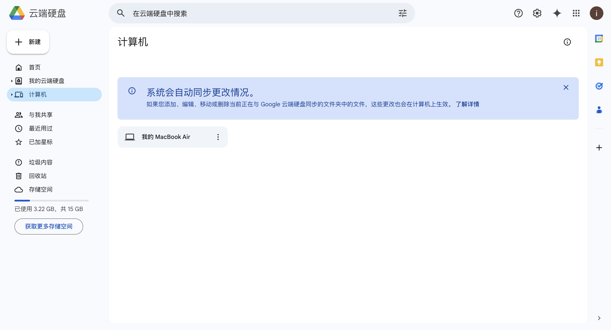

## 这份文档用来说明使用Colab训练CIFAR-10数据集的方法
**该实例来自于阿斯顿·张、李沐的《动手学深度学习》**
[点击此处跳转实例书籍页面](https://zh.d2l.ai/chapter_computer-vision/kaggle-cifar10.html)
[点击此处查看Jupyter文档 和下载](../code/kaggle-cifar10.ipynb)
**数据准备:由于程序运行,jupyter文档都有,我们主要是要将数据从kaggle下载到Colab中**
**1.我们先从kaggle下载数据集到电脑上面**
**2.我们需要将数据上传到Colab中,由于直接在Colab里上传或者用网页版的谷歌硬盘上传大数据都会很慢,于是我们下载Google Drive客户端来加快上传速度**
- 1.下载地址:https://www.google.com/drive/download/
- 2.下载完成后,安装,并登陆自己的谷歌账号
- 3.选择Google Drive客户端里的云端偏好设置.选择在线访问文件.可以自己创建一个专门用来传数据的文件夹,我这里在桌面建立了一个“文件分享”文件夹.

**之后只需要将文件拖到文件夹中,它就会十分快速的传到云盘,可以在云盘的“计算机”下找到.**

**注意:不要把含有大量数据的文件夹直接拖入,不然会传输特别久.如果是自己的数据,打包成zip文件后,再上传,之后在colab上解压**
- 4.运行如下代码就可以,将该文件夹解压到colab中(注意,解压文件夹请解压到Colab提供的机子当中,比如../data,不要解压到MyDrive中,因为如果是大数据的话,云端的I/O十分的慢,50万张图片的解压要2个小时,但是如果是解压到../data中,只需要1分钟,尽管每次解压后12小时就会消失,但是也比加载到云盘来的方便)

**解压的一个例子:**
```python
import sys
from google.colab import drive
drive.mount('/content/gdrive')
#这里的My Drive是你云盘的根目录

import zipfile
import os
from tqdm import tqdm

def unzip_file(zip_path, extract_to):
    if not os.path.exists(extract_to):
        os.makedirs(extract_to)
    with zipfile.ZipFile(zip_path, 'r') as zip_ref:
        total_files = len(zip_ref.infolist())
        with tqdm(total=total_files, desc=f'Extracting {os.path.basename(zip_path)}', unit='file') as pbar:
            for file in zip_ref.infolist():
                zip_ref.extract(file, extract_to)
                pbar.update(1)

# 定义要解压的文件路径和目标路径
train_zip_path = '/content/gdrive/MyDrive/Colab Notebooks/data/cifar-10/train.zip'
test_zip_path = '/content/gdrive/MyDrive/Colab Notebooks/data/cifar-10/test.zip'

#这里的路径请不要选择My Drive,因为解压到My Drive中会特别慢
extract_to_path = '../dataSet1/CIFAR-10'

unzip_file(train_zip_path, extract_to_path)
unzip_file(test_zip_path, extract_to_path)
```
**注意:这里的路径是我自己的路径,请根据自己的路径更改**

**3.接下来我们就可以运行Jupyter文档中的代码了,这里是一个简单的ResNet-18模型,用来训练CIFAR-10数据集,经过测试,使用T4GPU,训练时间为20min左右.**


