# Use-COLAB-Traing-CIFAR10
记录使用COLAB搭建环境,训练VGG11和训练CIFAR-10的数据

[点击此处查看训练CIFAR-10的文档](Markdown/Traing-resnet-CIFAR-10.md)

**1.在colab网址 https://colab.google/ 上open Colab**
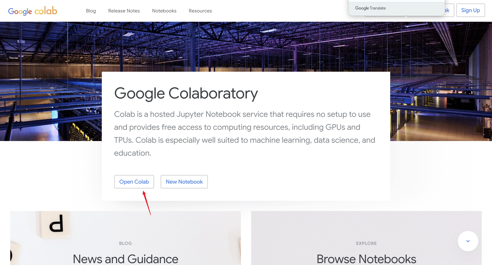

**2.点击文件 选择在云端硬盘建立笔记本,这里的笔记本其实就是Jupyter笔记本,而且Colab在该服务器上已经有了pytorch和tensorflow以及各种常用的库.**
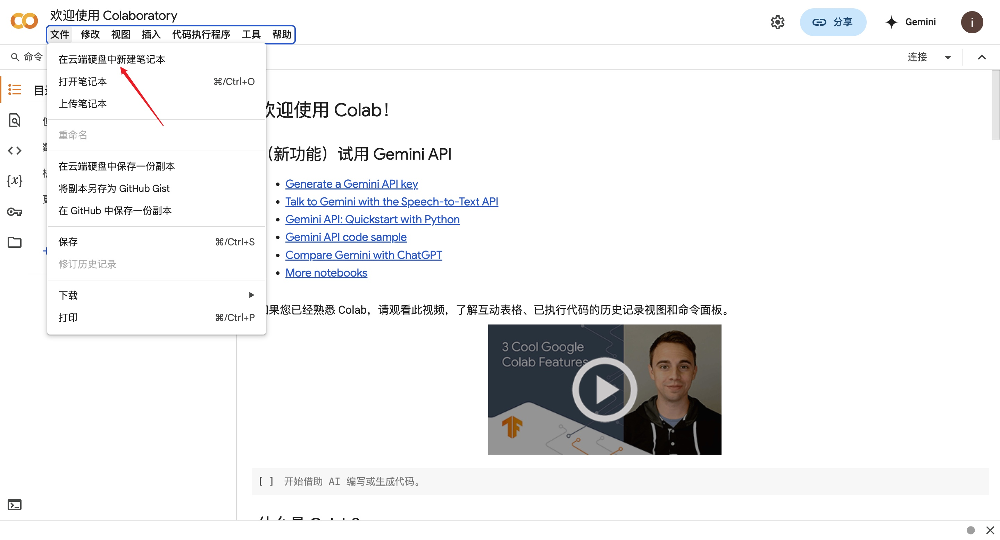

**PS:每次建立其实并不需要这么麻烦,只要在Google硬盘上直接右键选择'新建'即可**
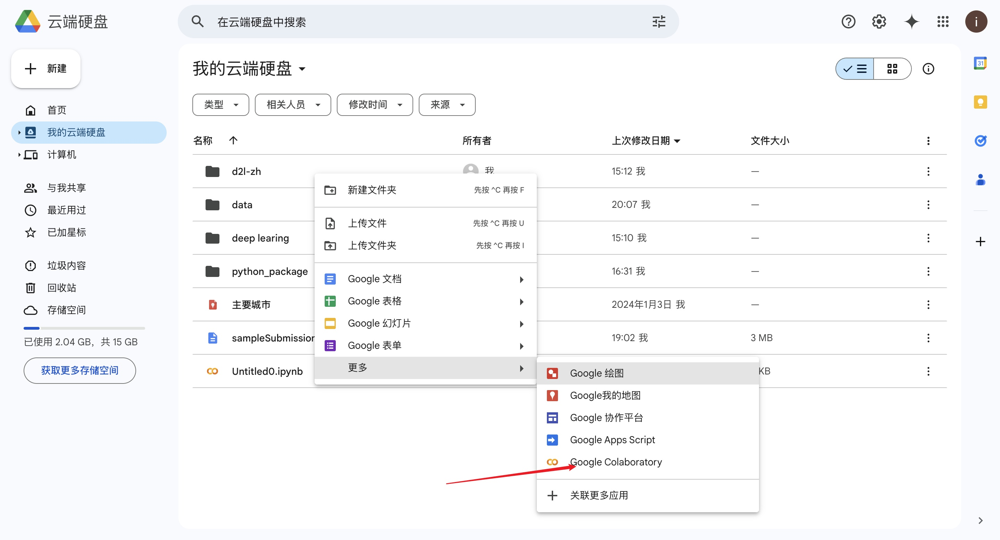

**3.注意,谷歌云盘和创建Jupyter之后的文件存放是不互通的(但是可以把云盘文件挂载,之后会说明),建立Jupyter进去之后点击左边的文件部分,相当于谷歌给你提供了一台没有操作系统,只有python和各种库的电脑,甚至jupyter也给你建立完毕了.**
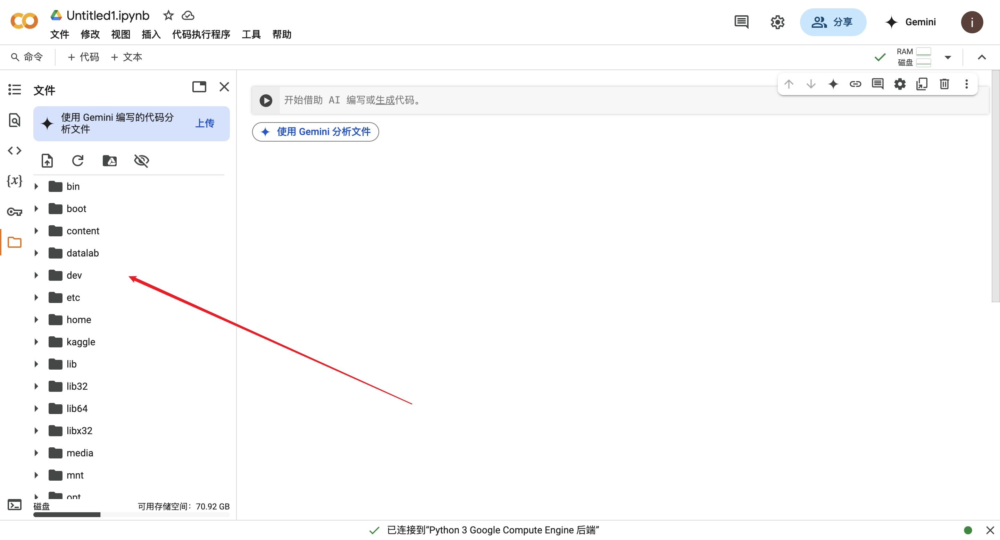

**4.可以使用以下命令将云盘文件挂载到Jupyter:**
```python
from google.colab import drive
drive.mount('/content/gdrive')#这里的/content是固定的,表明的是根文件夹目录,而gdrive是你挂载的文件夹名字,可以自己取名字
```
**执行之后可以会提示让你登陆云盘，并授权访问你的云盘文件。**
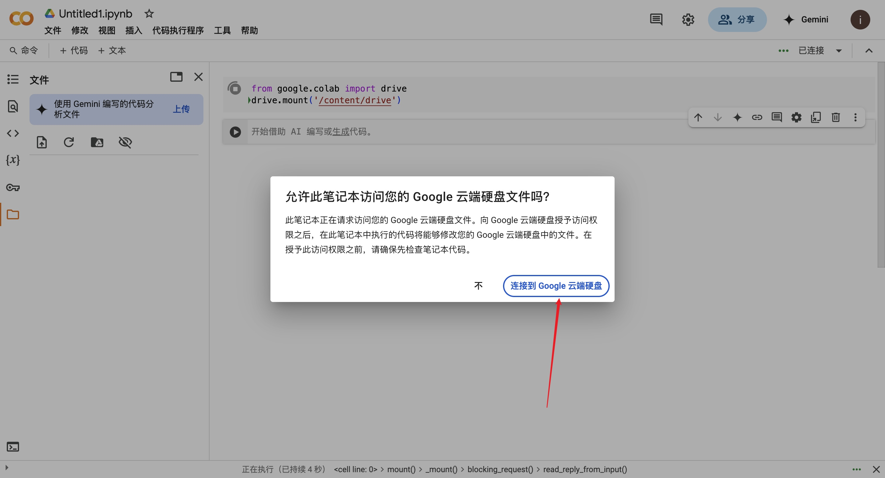

**5:挂载之后左边的文件会出现一个gdrive,这个就是你的云盘里的所有资料,你可以用python访问它,注意:只有访问gdrive,你的云盘里的数据才会变,改变其他的文件夹,挂载12小时后就会消失.**
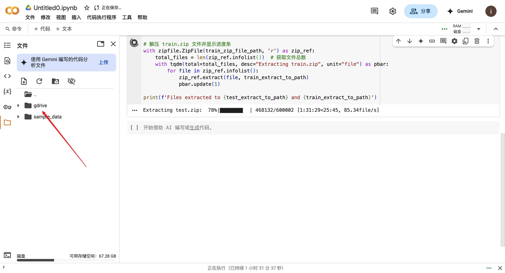
**PS:图片里的代码不一样是因为我在解压东西,运行的是上面的那个代码.**

**6.点击代码执行程序->更改运行时类型,可以选择GPU运行,可以选择这里的T4 GPU,**
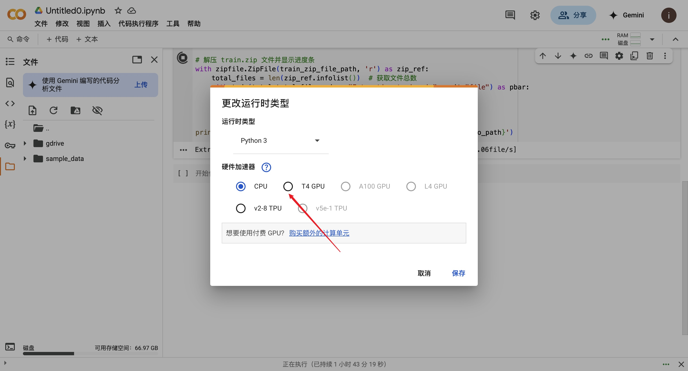

**以下是T4 GPU的性能对比**
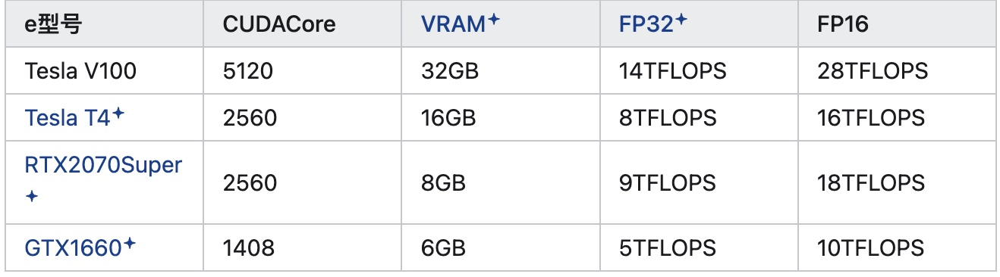

**7.接下来我们运行一个简单的程序,以阿斯顿·张 ,李沐等人所写的《动手学深度学习》里的VGG模型为例**
[点击这里查看VGG模型,跳转书籍内容](https://zh.d2l.ai/chapter_convolutional-modern/vgg.html)

[点击这里查看和下载Jupyter文件](code/vgg.ipynb)

```jupyter
import torch
from torch import nn
from d2l import torch as d2l


def vgg_block(num_convs, in_channels, out_channels):
    layers = []
    for _ in range(num_convs):
        layers.append(nn.Conv2d(in_channels, out_channels,
                                kernel_size=3, padding=1))
        layers.append(nn.ReLU())
        in_channels = out_channels
    layers.append(nn.MaxPool2d(kernel_size=2,stride=2))
    return nn.Sequential(*layers)
```
```jupyter
    def vgg(conv_arch):
    conv_blks = []
    in_channels = 1
    # 卷积层部分
    for (num_convs, out_channels) in conv_arch:
        conv_blks.append(vgg_block(num_convs, in_channels, out_channels))
        in_channels = out_channels

    return nn.Sequential(
        *conv_blks, nn.Flatten(),
        # 全连接层部分
        nn.Linear(out_channels * 7 * 7, 4096), nn.ReLU(), nn.Dropout(0.5),
        nn.Linear(4096, 4096), nn.ReLU(), nn.Dropout(0.5),
        nn.Linear(4096, 10))

net = vgg(conv_arch)
```
```jupyter
X = torch.randn(size=(1, 1, 224, 224))
for blk in net:
    X = blk(X)
    print(blk.__class__.__name__,'output shape:\t',X.shape)
```
```jupyter

ratio = 4
small_conv_arch = [(pair[0], pair[1] // ratio) for pair in conv_arch]
net = vgg(small_conv_arch)
```
```jupyter
lr, num_epochs, batch_size = 0.05, 10, 128
train_iter, test_iter = d2l.load_data_fashion_mnist(batch_size, resize=224)
d2l.train_ch6(net, train_iter, test_iter, num_epochs, lr, d2l.try_gpu())
```
**8.在运行上述代码之前,我们需要先下载该书的专门的库d2l,该库Colab并没有提供**
```python
!pip install d2l#运行该代码
```
**PS:运行该代码之后有可能出现警告,重启之后就可以了,不用再运行这个代码了.**
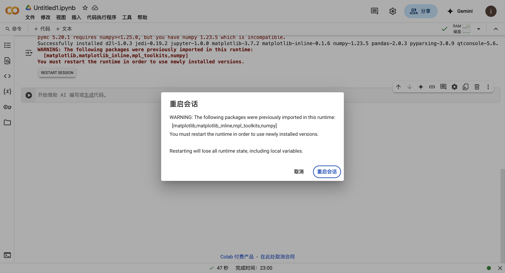

**PS:这样运行之后,d2l库是保存在Colab的主机当中,并不在你的Google云盘里.导致你每次要用这个函数的时候,都需要重新安装该库。**<p>
**这里提供一种方法将下载的库保存到Google云盘中,之后只需要加载就好,不需要重新下载.**

**在根目录中创建一个python_package文件夹,这个文件夹名字可以自己取.用来存放下载的库.**
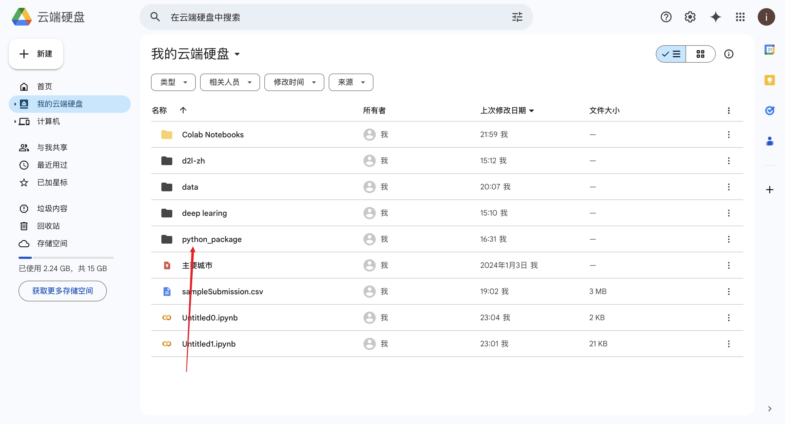
**创建一个Jupyter文件,运行**
**1.**
```python
import os, sys 
# 挂载google drive
from google.colab import drive 
drive.mount('/content/gdrive')
#这里的/content是固定的,表明的是根文件夹目录,而gdrive是你挂载的文件夹名字,可以自己取名字

nb_path = '/content/notebooks'
os.symlink('/content/gdrive/My Drive', nb_path)
sys.path.insert(0, nb_path) 
```
**2.**
```python
# 将安装包安装到指定路径（这里安装到Colab Notebooks/python_package目录下）
!pip install --target=$nb_path d2l 
```

**3.之后每次运行之前执行下面这个代码之后,就可以import了**
```python
import sys
from google.colab import drive
drive.mount('/content/gdrive')
#这里的My Drive是你云盘的根目录
sys.path.insert(0,"/content/gdrive/My Drive/python_package/")
```

**这样就可以将库下载到云盘上了,python_package目录如下:**
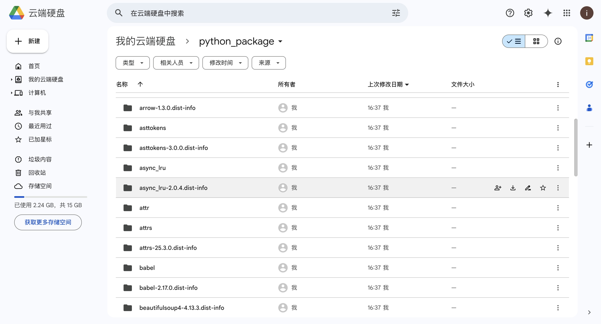

**接下来我们运行一下书里的VGG实例,看一下效果.**

**更改为T4 GPU.**
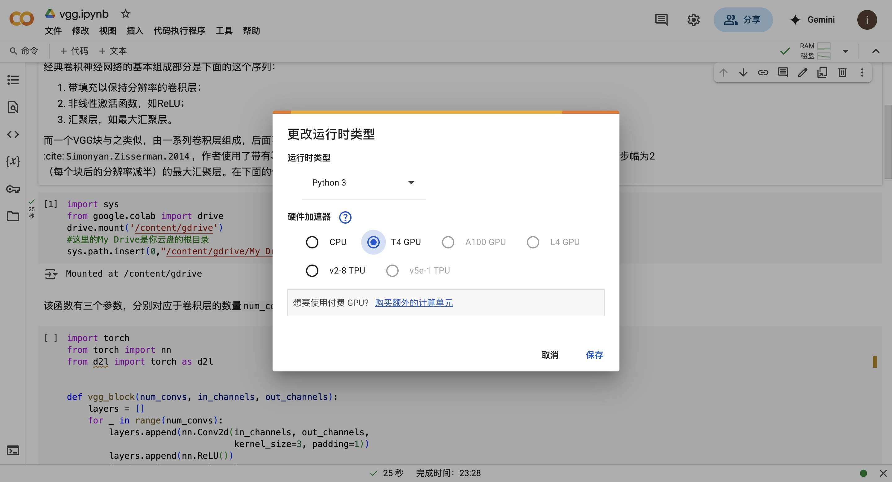

**运行,加载库代码**
```python
import sys
from google.colab import drive
drive.mount('/content/gdrive')
#这里的My Drive是你云盘的根目录
sys.path.insert(0,"/content/gdrive/My Drive/python_package/")
```
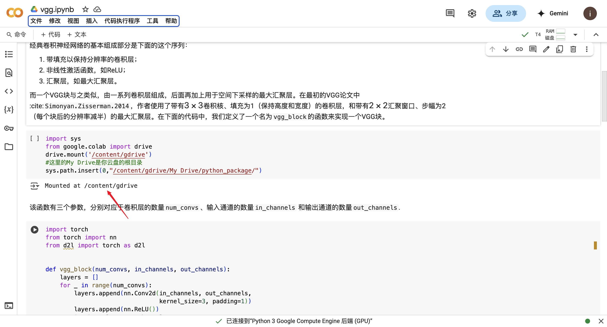

**训练完成,训练时长为15分3秒**
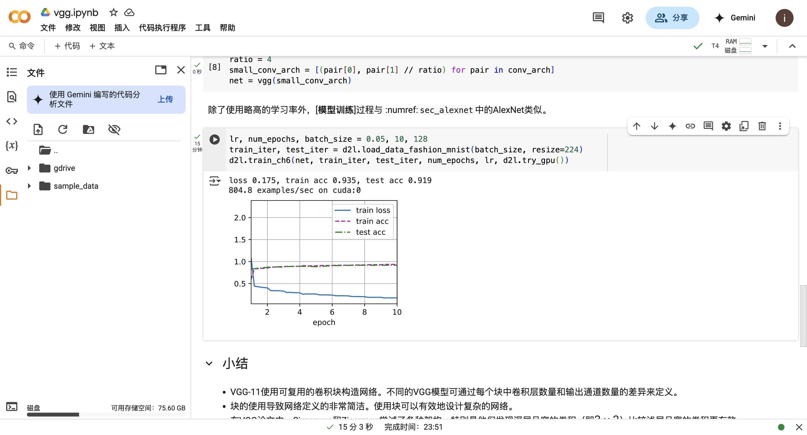

**解决自动掉线问题**
```javascript
直接在 Console 输入 allow pasting
```
```javascript
function ClickConnect(){
  console.log("Working"); 
  document
    .querySelector("#top-toolbar > colab-connect-button")
    .shadowRoot
    .querySelector("#connect")
    .click()
}
 
setInterval(ClickConnect,1*60000)   //1 分钟点一次
```

